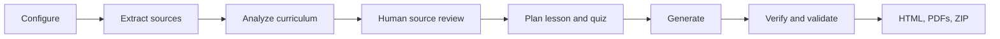

# Kids Learning & Quiz Studio

Kids Learning & Quiz Studio turns concepts and optional learning material into a child-friendly concept lesson, an original interactive practice paper, printable PDFs, a separate answer key, and a ZIP learning pack. It is designed for a parent or teacher and supports Grades 1–8, Mathematics, Science, English, Social Studies, or a custom subject.

The interface and offline artifacts generalize the supplied Grade 2 mathematics references: bright cards, short teaching sections, worked examples, quick checks, progress, a visible paper blueprint, typed and choice answers, manual drawing review, supportive scoring, and print layouts.

## Architecture



`src/graph.py` defines the auditable LangGraph state flow. Pydantic models are the contracts between analysis, LLM generation, validation, and rendering. The live Streamlit workflow uses a server-side OpenAI API key from `OPENAI_API_KEY` to analyze inputs and author both lesson and quiz content. A single administrator account gates the entire UI. Deterministic Python checks counts, marks, arithmetic metadata, duplicates, and MCQ consistency before rendering files and the package manifest. Tests use local fixtures and do not make paid API calls.

Supporting material is optional whenever concepts are entered. Attachments-only mode requires at least one readable file. Supported references are PDF, PNG, JPG/JPEG, WebP, HTML, TXT, and Markdown. Limits are 10 files, 50 MB total, 25 analyzed PDF pages, and 10 images. Text PDFs and text/HTML files are extracted locally. Scanned pages and images are identified for a configured vision-provider path; the deterministic MVP asks the teacher to approve or enter concepts.

## Run locally

Python 3.11–3.13 is recommended.

Windows PowerShell:

```powershell
py -m venv .venv
.\.venv\Scripts\python.exe -m pip install --upgrade pip
.\.venv\Scripts\python.exe -m pip install -r requirements.txt
$env:OPENAI_API_KEY="your-openai-project-key"
$env:OPENAI_MODEL="gpt-5.6-luna"
$env:LEARNCRAFT_ADMIN_USER="admin"
$env:LEARNCRAFT_ADMIN_PASSWORD="use-a-long-unique-password"
.\.venv\Scripts\python.exe -m streamlit run app.py
```

macOS/Linux:

```bash
python3 -m venv .venv
source .venv/bin/activate
python -m pip install --upgrade pip
pip install -r requirements.txt
export OPENAI_API_KEY="your-openai-project-key"
export OPENAI_MODEL="gpt-5.6-luna"
export LEARNCRAFT_ADMIN_USER="admin"
export LEARNCRAFT_ADMIN_PASSWORD="use-a-long-unique-password"
streamlit run app.py
```

`OPENAI_API_KEY`, `LEARNCRAFT_ADMIN_USER`, and `LEARNCRAFT_ADMIN_PASSWORD` are required. `OPENAI_MODEL` is optional and defaults to `gpt-5.6-luna`. For local development, copy `.env.example` to `.env`; the app loads that file automatically. Existing shell or hosting environment variables take precedence over `.env`. The app fails closed when required configuration is missing, and the API key and admin password are never placed in Streamlit session state. Do not commit `.env` or any real secrets.

Run tests with:

```bash
pytest -q
```

## Streamlit Community Cloud

1. Push this repository to GitHub.
2. In Streamlit Community Cloud, create an app with `app.py` as the entry point.
3. Configure `OPENAI_API_KEY`, `LEARNCRAFT_ADMIN_USER`, `LEARNCRAFT_ADMIN_PASSWORD`, and optionally `OPENAI_MODEL` in the deployment environment.
4. Deploy. `requirements.txt` is the only dependency manifest and no system package file is needed.
5. Use the Cloud sharing/privacy controls if generated learning material should not be public.

Uploads and generated bytes live only in the active Streamlit session. Authentication state is per browser session; credentials remain server-side. The app uses no database and does not intentionally retain student data. Downloaded HTML stores only a document-scoped progress list in the browser. OpenAI API use incurs charges to the configured key; source excerpts, repairs, retries, and pages are deliberately bounded.

## Troubleshooting and limits

- An unreadable scanned PDF needs a configured vision model; otherwise enter the concepts manually.
- Missing environment configuration blocks the entire app; set the required variables and restart Streamlit.
- A rejected API key blocks analysis and generation; verify `OPENAI_API_KEY` in the server environment.
- For model timeouts, retry with fewer/shorter sources; provider calls use bounded timeouts and retries.
- If dependency installation fails, confirm the supported Python version and upgrade pip.
- The MVP does not grade handwriting, drawings, or subjective answers, does not persist sessions, and outputs English only.

Roadmap: richer structured model prompts, bilingual packs, saved templates, durable teacher libraries, and progress dashboards.

## Screenshots

Run the app to see the five-step configuration, review, preview, and download workflow. Screenshot placeholders can be replaced with deployment captures in `assets/`.
